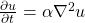
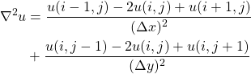
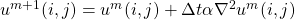
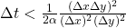

# HeatEquation.jl

This is a Julia version of [this educational heat-equation
implementation in C/C++/Fortran demostrating various parallel
programming approaches](https://github.com/cschpc/heat-equation) from
[CSC – IT Center for Science](https://www.csc.fi/en/home).  

## The two dimensional heat equation

Heat (or diffusion) equation is

<!-- Equation
\frac{\partial u}{\partial t} = \alpha \nabla^2 u
--> 


where **u(x, y, t)** is the temperature field that varies in space and time,
and α is thermal diffusivity constant. The two dimensional Laplacian can be
discretized with finite differences as

<!-- Equation
\begin{align*}
\nabla^2 u  &= \frac{u(i-1,j)-2u(i,j)+u(i+1,j)}{(\Delta x)^2} \\
 &+ \frac{u(i,j-1)-2u(i,j)+u(i,j+1)}{(\Delta y)^2}
 \end{align*}
 --> 
 

 Given an initial condition (u(t=0) = u0) one can follow the time dependence
 of
 the temperature field with explicit time evolution method:

 <!-- Equation
 u^{m+1}(i,j) = u^m(i,j) + \Delta t \alpha \nabla^2 u^m(i,j) 
 --> 
 

 Note: Algorithm is stable only when

 <!-- Equation
 \Delta t < \frac{1}{2 \alpha} \frac{(\Delta x \Delta y)^2}{(\Delta x)^2
 (\Delta y)^2}
 -->
 

## How to run

An example run is demonstrated in [example.jl](./example.jl):

```julia
using HeatEquation

ncols, nrows = 1000, 1000 
nsteps, image_interval = 500, 0

# initialize current and previous states to the same state
current, previous = initialize(ncols, nrows)

simulate!(current, previous, nsteps, image_interval)
```

## How to test

```bash
cd test
julia --project=.. runtests.jl
```

